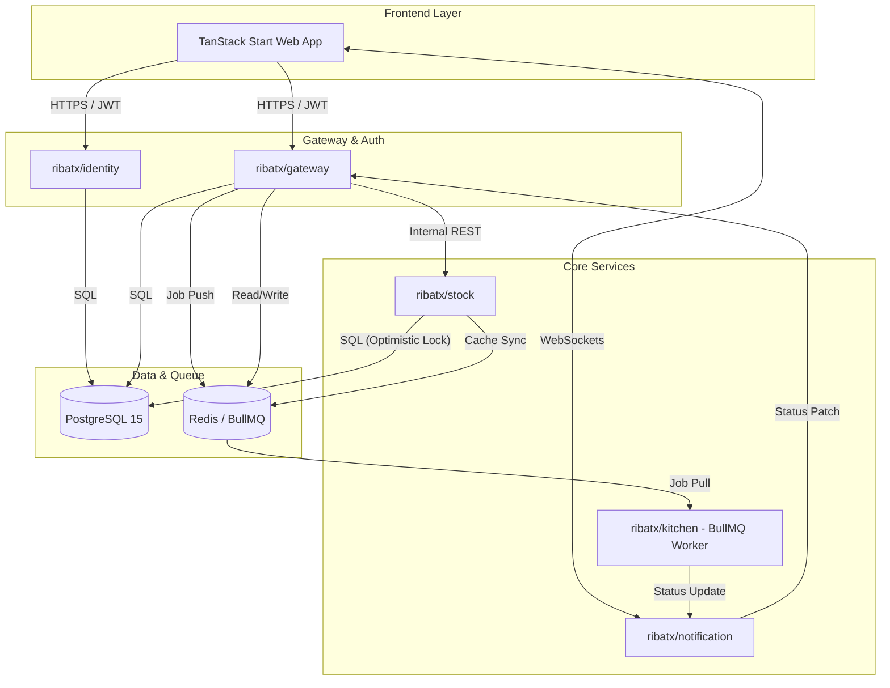
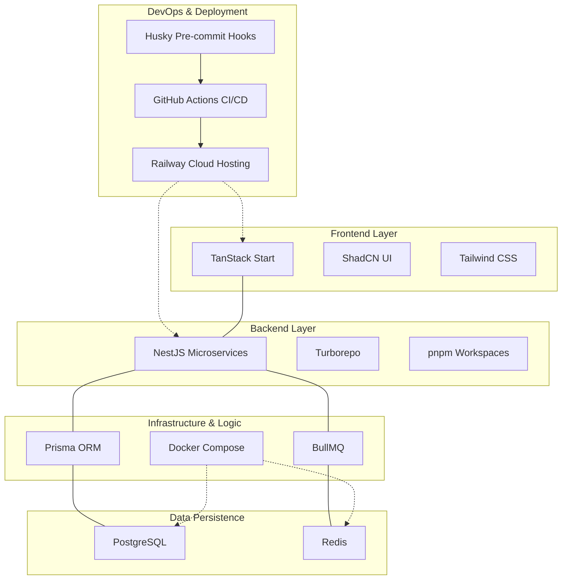

# System Visuals

<i>(in Mermaid)</i>

## 1. System Architecture & Data Flow

This diagram illustrates the microservices orchestration, communication protocols, and multi-layered persistence strategy of the RibatX Cafeteria System.

## 2. Technology Stack Breakdown

A high-level view of the core technologies powering each layer of the RibatX ecosystem.

