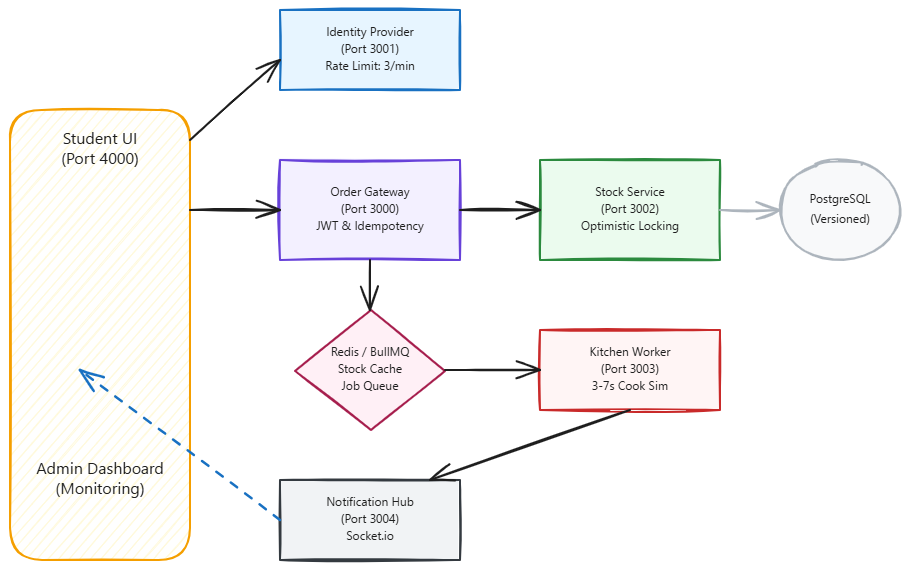
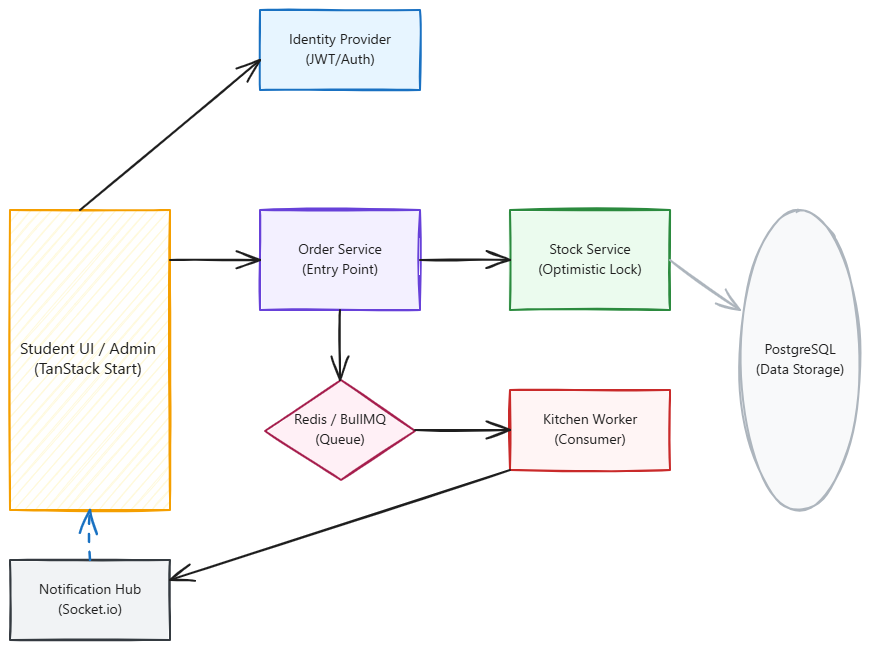

# Requirements and Architecture: RibatX Cafeteria

## 1. Executive Summary

The IUT Cafeteria currently struggles with a "legendary digital rush" during the month of Ramadan. The existing "Spaghetti Monolith" system consistently fails under high load, suffering from database locks, deadlocked threads, and frequent service crashes, particularly within the Ticketing Service. These technical failures lead to physical queues, server freezes, and a fragile notification system that often leaves students in "digital limbo," uncertain about the status of their Iftar orders.

To address these critical issues, we are refactoring the monolithic architecture into a distributed, fault-tolerant microservices system. This new architecture is designed to handle hundreds of concurrent orders reliably by leveraging asynchronous processing, optimistic locking for inventory management, and real-time push notifications. The goal is to provide a seamless digital experience for students and robust monitoring tools for administrators, ensuring the system remains resilient even under peak Ramadan load.

## 2. Problem Statement

The current monolithic system at IUT Cafeteria is unable to scale with the high volume of concurrent requests during Ramadan. Key pain points include:

- **Database locks and bottlenecks:** Concurrent order requests lead to deadlocked threads and slow performance.
- **Service crashes and loss of data:** The "Ticketing Service" fails under load, causing orders to disappear.
- **Lack of asynchronous processing:** Synchronous workflows result in long physical queues and unresponsive servers.
- **Fragile notification system:** Students are left in "digital limbo" without updates when services fail.

The architectural overhaul breaks this monolith into a distributed, fault-tolerant microservice system where each component is isolated and communicates over the network.

## 3. Stakeholders & User Personas

| Name                          | Role            | Goals                                                            | Frustrations                                      |
| :---------------------------- | :-------------- | :--------------------------------------------------------------- | :------------------------------------------------ |
| **IUT Students**              | Customers       | Place Iftar orders quickly and track status in real-time.        | Loading spinners, failed orders, and uncertainty. |
| **Cafeteria Administration**  | Operators       | Manage cafeteria operations and ensure smooth order fulfillment. | System downtime and manual tracking overhead.     |
| **Kitchen Staff**             | Processors      | Receive and process orders efficiently without technical delays. | Missing orders and disorganized queues.           |
| **University Administration** | Decision Makers | Provide a reliable service to the student body.                  | Negative student feedback due to system failures. |

### User Personas

| Persona            | Role                 | Goals                                                                                                  | Frustrations                                                                                |
| :----------------- | :------------------- | :----------------------------------------------------------------------------------------------------- | :------------------------------------------------------------------------------------------ |
| **Fasting Farhan** | IUT Student          | Place an Iftar order quickly at 5:00 PM and track its status in real-time until pickup.                | Loading spinners, failed orders, and uncertainty about order status.                        |
| **Admin Arif**     | System Administrator | Monitor the operational health of all services and ensure the system is resilient to partial failures. | Lack of visibility into microservice health and inability to simulate failures for testing. |

## 4. User Stories

- **As a student**, I want to authenticate securely via the Identity Provider so that I can receive a valid JWT for ordering.
- **As a student**, I want to see real-time status updates (Pending → In Kitchen → Ready) so that I know exactly when my Iftar is ready.
- **As an admin**, I want to view a Health Grid and Live Metrics so that I can monitor latency and throughput in real-time.
- **As an admin**, I want to use a 'Chaos Toggle' to kill specific services so that I can observe the system's fault tolerance.

## 5. Use Cases

### Use Case 1: Secure Authentication

- **Actor:** Student
- **Preconditions:** Student has a valid university account.
- **Flow:**
  1. Student enters credentials in the Student Journey UI.
  2. UI sends credentials to the Identity Provider.
  3. Identity Provider verifies credentials and issues a secure JWT.
  4. UI stores the JWT for subsequent API requests.
- **Postconditions:** Student is authenticated and possesses a valid token for ordering.

### Use Case 2: Placing an Iftar Order

- **Actor:** Fasting Farhan
- **Preconditions:** Student is authenticated and items are in stock.
- **Flow:**
  1. Student selects Iftar items and submits the order via the Student Journey UI.
  2. Order Gateway validates the JWT and checks Redis cache for stock (high-speed check).
  3. Order Gateway calls Stock Service `/stock/reserve` to reserve items using **Optimistic Locking** (version-based concurrency control).
  4. Stock Service updates PostgreSQL and write-back to Redis cache.
  5. Order Gateway adds the order to the `kitchen-orders` queue (BullMQ).
  6. System acknowledges the order to the Student within 2 seconds (status: PENDING).
- **Postconditions:** Order is successfully queued; stock is reserved; user receives immediate feedback.

### Use Case 3: Monitoring and Resilience Testing

- **Actor:** Admin Arif
- **Preconditions:** Admin is logged into the Admin Dashboard.
- **Flow:**
  1. Admin views the Health Grid to check the status of all microservices.
  2. Admin observes Live Metrics (latency, throughput).
  3. Admin activates the "Chaos Toggle" for a specific service (e.g., Notification Hub).
  4. Admin observes how the system handles the partial failure.
- **Postconditions:** Admin gains insight into system health and fault tolerance capabilities.

## 6. Functional Requirements

1.  **JWT Authentication [Must]:** Secure JWT-based authentication via Identity Provider; all student routes are protected.
2.  **Stock Caching [Must]:** High-speed Redis cache check in the Gateway to protect the database from redundant load.
3.  **Transactional Stock Decrement [Must]:** Implementation of version-based Optimistic Locking in the Stock Service to prevent over-selling.
4.  **Asynchronous Order Processing [Must]:** Decouple user acknowledgment (< 2s) from cooking time using BullMQ.
5.  **Real-time Notifications [Should]:** Push status transitions (PENDING → IN_KITCHEN → READY) via Socket.io.
6.  **Observability & Monitoring [Should]:** Health and metrics endpoints for all services; Admin Dashboard for live status monitoring.
7.  **Chaos Engineering [Could]:** Manual trigger to "kill" services via Chaos Controller to verify system resilience.

## 7. Non-Functional Requirements

- **Resilience & Fault Tolerance:** Partial failures (e.g., Notification Hub) do not block the order flow.
- **Idempotency:** Gateway handles retries safely using idempotency keys stored in Redis.
- **Performance:** Handles hundreds of concurrent requests via decoupled architecture and caching.
- **Observability:** 200 OK for healthy dependencies, 503 for failures; metrics for throughput and latency.

## 8. System Architecture Overview

The system is built as a distributed microservices architecture to ensure scalability and fault tolerance.

- **Identity Provider (Port 3001):** Single source of truth for student verification; issues JWT; implements rate limiting (3 login attempts/min).
- **Order Gateway (Port 3000):** Primary entry point; handles token validation, high-speed stock check in Redis, and job production for BullMQ.
- **Stock Service (Port 3002):** Manages inventory; uses version-based Optimistic Locking for consistent stock decrement.
- **Kitchen Worker (Port 3003):** Consumes jobs from BullMQ; simulates cooking (3-7s); notifies status changes.
- **Notification Hub (Port 3004):** Manages Socket.io connections; pushes real-time updates to students.
- **Infrastructure:** PostgreSQL (5 logical DBs), Redis (Cache, BullMQ state, Rate limiting).

## 9. Component Interaction Diagram

## 10. Data Flow Diagram

### Data Flow Narrative

1.  **Step 1:** Student authenticates via Identity Provider to receive a secure JWT.
2.  **Step 2:** Student places order via the Gateway; Gateway validates token and performs a high-speed stock check in Redis.
3.  **Step 3:** Gateway calls Stock Service; Stock Service performs transactional reserve via Optimistic Locking and updates cache.
4.  **Step 4:** Gateway adds order to BullMQ kitchen-orders queue and returns acknowledgment to Student UI.
5.  **Step 5:** Kitchen Worker consumes the job, notifies Notification Hub (status: IN_KITCHEN), and simulates cooking (3-7s).
6.  **Step 6:** Kitchen Worker finishes cooking and notifies Notification Hub (status: READY).
7.  **Step 7:** Notification Hub pushes the status updates to the Student UI browser via Socket.io/WebSockets.

### Excalidraw Data Flow

## 11. Deployment Architecture

The system utilizes a modern, containerized microservices architecture:

- **Containerization:** All microservices are containerized using Docker for consistency across environments.
- **Orchestration:** Managed via Docker Compose for easy single-command deployment (`docker compose up`).
- **Isolation:** Implements a database-per-service strategy to ensure independent scaling and reduced blast radius.
- **State Management:** Redis is used centrally for caching, rate limiting, and BullMQ state.
- **CI/CD:** Automated pipelines via GitHub Actions handle testing and validation.

## 12. Assumptions & Constraints

- **University Auth:** Assumes students have valid accounts manageable by the Identity Provider.
- **Network:** Assumes reliable WebSocket persistence for real-time status updates.
- **Concurrency:** Designed for hundreds of concurrent orders during peak Ramadan rush.
- **Cooking Simulation:** Processing time is constrained to 3-7 seconds to model real-world behavior.
- **Isolation:** Infrastructure isolation via 5 separate database connections for microservices.

## 13. AI Policy & Disclosure

This project was developed with the assistance of AI tools to enhance productivity and code quality.

- **Tools Used:** GitHub Copilot, Google Gemini.
- **Usage:** Copilot was used for logic scaffolding (e.g., NestJS services, BullMQ processors) and UI component development. Gemini was used for architectural analysis and documentation refinement.
