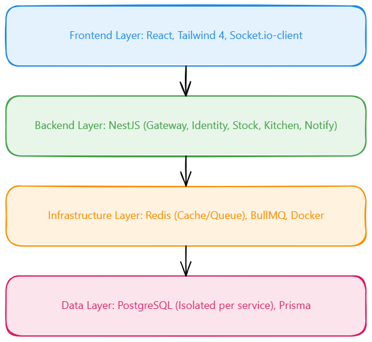

# Tools & Stack Report: IUT Cafeteria Digital Transformation

## 1. Introduction

The IUT Cafeteria system follows a "Resilience First" philosophy. Moving from the "Spaghetti Monolith," our stack prioritizes **fault tolerance, asynchronous processing, and developer velocity**. Every component—from NestJS for modularity to BullMQ for reliable queuing—ensures the Ramadan rush is handled without service crashes.

## 2. Technology Stack Summary Table

| Tool               | Category  | Purpose          | Reasoning                                                                            |
| :----------------- | :-------- | :--------------- | :----------------------------------------------------------------------------------- |
| **NestJS**         | Backend   | Microservices    | Modular, decorator-based framework; native support for microservices and WebSockets. |
| **Prisma**         | ORM       | Data Access      | Type-safe queries; handles version-based **Optimistic Locking** out-of-the-box.      |
| **Redis**          | In-Memory | Caching & State  | Sub-millisecond stock checks; manages BullMQ state and rate limiting.                |
| **BullMQ**         | Queue     | Async Processing | Redis-backed reliable queue for decoupling ordering from cooking.                    |
| **PostgreSQL**     | Database  | Persistence      | Multi-instance ACID compliance for identity, stock, and orders.                      |
| **Socket.io**      | Real-time | Notifications    | Simplified WebSocket management for pushing order status updates.                    |
| **Tailwind CSS 4** | Styling   | Premium UI       | Rapid styling with modern utility classes for a "high-end" interface.                |
| **TanStack Start** | Frontend  | Web App          | Modern React framework for high-performance single-page applications.                |

## 3. Detailed Justification

### Resilience & Asynchronicity (BullMQ, Redis)

To prevent server freezes, we moved heavy "cooking" logic to background workers using **BullMQ**. The Gateway returns a response in <2s, while the kitchen processes jobs at its own pace. **Redis** acts as a defensive shield, serving stock data instantly and protecting PostgreSQL from rush-hour load.

### Data Consistency (Prisma, PostgreSQL)

Using **Prisma's** version-based update logic, we ensure that stock decrements are atomic and prevented from over-selling. **PostgreSQL** provides 5 logical databases, meeting the requirement for service isolation and reducing blast radius.

### Real-time Experience (Socket.io)

**Socket.io** eliminates the need for manual polling. As the Kitchen Worker completes a job, it patches the Notification Service, which instantly pushes status updates (PENDING → READY) to the student's browser.

## 4. Architecture Compatibility

The stack directly enables a **Database-per-Service** pattern. Separate Postgres schemas/instances ensure that a failure in the Notification service doesn't impact Identity or Stock. Turbo monorepo management allows shared types and utilities across all 6 microservices.

## 5. Security & DevOps

- **JWT & Rate Limiting:** Identity service issues tokens and restricts brute-force attempts via Redis-based rate limiting (3/min).
- **CI/CD:** GitHub Actions runs unit tests for stock deduction and order validation on every push.
- **Observability:** `/health` and `/metrics` (Prometheus format) allow the Admin Dashboard to show real-time latency and throughput.

## 6. AI Usage & Disclosure

This project utilized **AI-driven development** to reach production-grade quality in record time.

- **GitHub Copilot:** Acted as a "Pair Programmer" for scaffolding NestJS modules, structuring BullMQ processors, and implementing the optimistic locking retry logic in the Stock Service.
- **Google Gemini:** Used for reanalyzing the system requirements, refining the architecture documentation, and ensuring compliance with hackathon rules.

## 7. Stack Diagram

